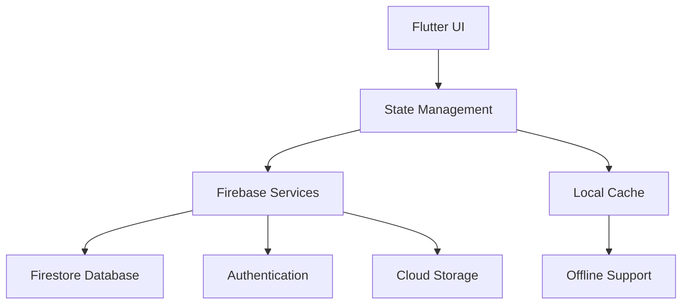

# CliniqFlow - Dental Clinic Management System

## Tech Stack
- **Frontend**: Flutter (Dart)
- **Backend**: Firebase (Firestore, Auth, Storage)
- **State Management**: Provider + ChangeNotifier
- **Testing**: flutter_test, fake_cloud_firestore
- **CI/CD**: GitHub Actions
- **Additional Packages**:
  - pdf, printing (prescription generation)
  - intl (localization)
  - share_plus (file sharing)
  - uuid (unique ID generation)

## Core Features
1. **Patient Management**
   - Profile creation
   - Medical history tracking
   - Appointment scheduling

2. **Clinical Visit Management**
   - Case sheet creation
   - Treatment documentation
   - Consent management

3. **Prescription System**
   - Digital prescription creation
   - Multi-drug support
   - PDF generation/printing
   - Secure sharing

4. **Offline Support**
   - Data synchronization
   - Local caching
   - Conflict resolution

## Firebase Configuration
To configure Firebase, navigate to the project root and execute the setup script:

```bash
./scripts/setup_firebase.sh
```

**Note**: The setup script is located at `scripts/setup_firebase.sh`

## Validation Checklist
### Data Integrity
- [ ] Patient profile validation
- [ ] Appointment conflict detection
- [ ] Prescription field validation

### Security
- [ ] Role-based access control
- [ ] Firestore security rules
- [ ] Data encryption at rest

### Offline Support
- [ ] Local data caching
- [ ] Conflict resolution
- [ ] Sync status indicators

## Increment 4: Prescription System
### Key Components
1. **Prescription Model**
   - Multi-drug support
   - Doctor/patient information
   - Timestamps

2. **PDF Generation**
   - Professional templates
   - Clinic branding
   - Medication details

3. **Print/Share**
   - Direct printing
   - Secure sharing
   - Temporary file management

### Security Measures
- Input validation
- Firestore security rules
- Audit trails
- Role-based permissions

## Project Status
- **Current Version**: 1.4.0
- **Last Deployment**: 2025-10-24
- **Next Milestone**: E-prescription integration

## Architecture Overview


## Contact
- **Maintainer**: ClinicFlow Team
- **Repository**: github.com/cliniqflow/cliniqflow
